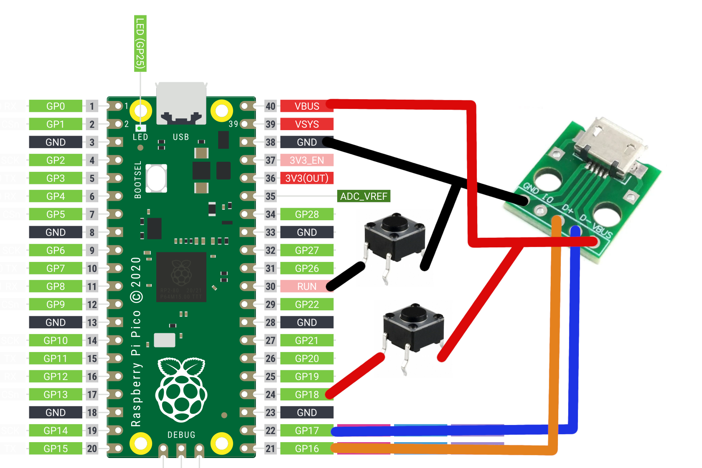
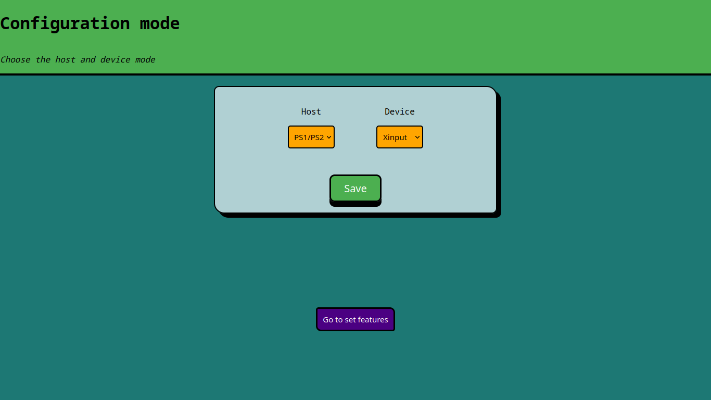
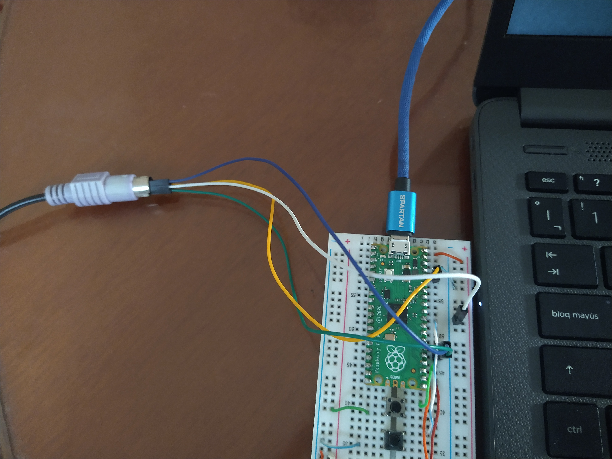
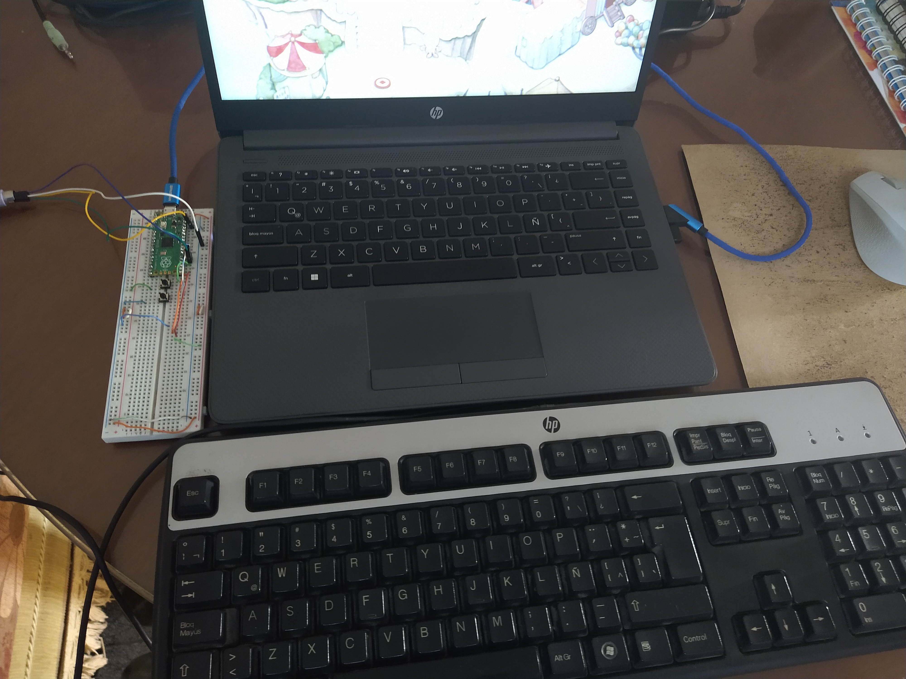

# PICO-GAMEPAD-CONVERTER

[](https://ko-fi.com/O4O8TQSC8)

PicoGamepadCoverter is a project designed for RP2040 or Raspberry Pi Pico and variants, that enabling switch to different gamepad modes using a gamepad as input. Re-use old gamepads that don't support USB connections or make compatibles with certain platform.

---
## Features

- Read input from USB and Bluetooth controllers.
- Read inputs from no USB peripherals.
- Web interface to choose between modes.
- Different out modes (Dinput, Xinput, Switch, Bluetooth, PS1/PS2, WII)
- Easy to use, no overcomplicated options.

---
## Getting Started

To get started with PicoGamepadConverter, follow the steps below:

### Prerequisites

- Raspberry Pi Pico microcontroller or another RP2040 boards.
- OTG cable (micro-USB or USB-C it depends on your board)
- USB female connector (Recommended be the same type of OTG cable)
- USB cable (micro-USB or USB-C it depends on your board)
- Two push buttons (_Optional but RECOMMENDED!_)
- Breadboard (_Optional_)

### Installation

1. [Download](https://github.com/Loc15/PicoGamepadConverter/releases) the build program and copy on the microcontroller.

2. Make the connections.




3. Go to configuration mode pressing the button on 18 GPIO on start. On WEB mode the LED start to blink.

4. Choose the modes on the web server. Access http://192.168.3.1 in a web browser to begin configuration.



5. Connect your gamepad, when it connected successfully the LED on the board gonna turn on.

6. Enjoy!


## Additional information

- The LED onboard indicates that a gamepad has been mounted successfully, it works on all host modes except **Keyboard PS/2**

- The additional USB female connector PINS are **16** and **17 GPIO**. 

---
#### PS/2 KEYBOARD

- The connection for Keyboard PS/2 are on **19 GPIO** for **DATA PIN** and **20 GPIO** for **CLOCK PIN**.





---
#### BLUETOOTH

- Bluetooth modes only works on Pico W.

- On **Bluetooth device mode**, the host connection is on **native usb female connector on the microcontroller**.

- On **Bluetooth device mode** if the LED blinks means that microcontroller not is connected still. The LED bliks faster than on WEB mode.

- On **Bluetooth device mode** if the LED is solid on means that it is connected.

- On **Bluetooth host mode** you must put the mac address of your gamepad. You can get this address connecting you gamepad to a PC or a mobile phone. This address _should_ be put just once time, next time you just need choose the mode.

---

#### WII


- You need go to config and set the Sensor-Bar Position on the Wii as **Above TV**.

- To connect to wii console you need press sync button.

- If the LED blinks means that microcontroller not is connected still. The LED bliks faster than on WEB mode.

- If the LED is solid on means that it is connected.

- It doesn't work on homebrew application for now. Still you can play wii games via homebrew, just open the game on a loader and on game try to sync.

- You can change between modes pressing **X** and **Y** (Xbox layout) at the same time.

- For controllers without **guide button** the home button is right thumbstick button.

- You can simulate movement for games that require it pressing the **LB** (Xbox layout) / the left shoulder button.

---
#### PS1/PS2

- The connection for PS1/PS2 controllers (host mode) are on **19 GPIO** for **COMMAND PIN**, **20 GPIO** for **CLOCK PIN**, **21 GPIO** for **ATTENTION PIN** and **22 GPIO** for **DATA PIN**.


- The connection for PS1/PS2 device mode are on **19 GPIO** for **DATA PIN**, **20 GPIO** for **COMMAND PIN**, **21 GPIO** for **ATTENTION PIN**, **22 GPIO** for **CLOCK PIN** and **26 GPIO** for **ACKNOWLEDGE PIN**.


- On PS1/PS2 device mode, the host connection is on **native usb female connector on the microcontroller**.

- On PS1/PS2 device mode, the alternative connection for Keyboard PS/2 are on **5 GPIO** for **DATA PIN** and **6 GPIO** for **CLOCK PIN**.

- On PS1/PS2 device mode, the alternative connection for PS1/PS2 controllers are on **5 GPIO** for **COMMAND PIN**, **6 GPIO** for **CLOCK PIN**, **7 GPIO** for **ATTENTION PIN** and **8 GPIO** for **DATA PIN**.

---
## Modes
Exist two parameter to choose on web interface, **host** and **device**. The first is the input and another one the output.

### HOST
#### USB MODES
- Xinput: Support Xbox controllers or Xinput compatibles controllers.
- Dinput: Support generic gamepads, PS4, PS3 and 8BITDO controllers.

#### Wireless MODES
- Bluetooth: Support generic gamepads, PS4 and 8BITDO controllers.

#### SPECIAL MODES
- Keyboard/PS2: Support keyboards with PS/2 connector.
- PS1/PS2: Support PS1 and PS2 controllers. (_Put a pull-up resistor on data pin_)

 ### DEVICE
 #### USB MODES
 - Xinput: Emulation of Xinput gamepad controllers (doesn't work on consoles, only on PC).
- Dinput: Emulation of a generic HID gamepad.
- Switch: Emulation of Switch Pro controller.

#### Wireless MODES
- Bluetooth: Emulation of a generic HID gamepad.
- Wii: Emulation of a Wiimote, Wiimote + Nunchuk and Classic controller.

#### SPECIAL MODES
- PS1/PS2: Emulation of a PS1 or PS2 controller.

---
## Features

You can to set some additional configuration if you required:


- **Block analogs** -> Disable the analog stick and keeping it on center.
- **Swap Dpad and Left analog.**
- **Add deadzone to analogs.**

---

## Testing
Controllers that was tested on different host modes.
 
| Tested Controllers     | 	Modes (Host) |
| ------------------     | --- |
| Logitech F710          | Xinput, Dinput |
| 8BitDo Ultimate 2.4G   | Xinput, Dinput, Bluetooth|
| 8BitDo Ultimate C 2.4G | **Doesn't work** |
| DualShock (PS1)        | PS1/PS2 |
| DualShock 2 (PS2)      | PS1/PS2 |
| DualShock 3 (PS3)      | Dinput |
| DualShock 4 (PS4)      | Dinput, Bluetooth|
| Keyboard HP KB-0316    | Keyboard PS/2 |

---

### Building

#### If you have set PICO SDK already

```
git clone https://github.com/Loc15/PicoGamepadConverter
cd PicoGamepadConverter/
git submodule update --init
cd src/
mkdir build
cd build
cmake ..
make
```

#### Else you can use a docker image

_The instructions below have been successful on Windows (11) but should mostly apply to Linux_

1. (windows) Install Docker Desktop
2. Setup pico sdk environment by following  [this guide](https://community.element14.com/products/raspberry-pi/b/blog/posts/working-with-pi-pico-c-c-projects-easily-a-docker-approach)
3. Open Docker Desktop
4. Find the `pc1` container, click on `⋮` and select `Open in Terminal` then type in these commands:

```
cd /home/dev
mkdir pico
cd pico
git clone --recursive https://github.com/Loc15/PicoGamepadConverter.git
```
5. Wait a bit then:

```
cd PicoGamepadConverter
mkdir build
cd build
cmake ../src
```

6. Wait a bit more then:

```
make
```

7. Wait some more, then reset your Pico (or other board) with BOOTSEL held down - the instructions below assume the Pico will be drive D:
8. Open a **windows command line** (i.e. windows powershell - NOT the docker terminal) and type in:

```
cd Downloads
docker cp pc1:/home/dev/pico/PicoGamepadConverter/build/PicoGamepadConverter.uf2 .
cp PicoGamepadConverter.uf2 d:
```
9. Start using...

---

## Troubleshooting

- On Bluetooth host mode if it doesn't connect on first, reboot and put your gamepad on pair mode.
- If it fails multiple times to connect on any bluetooth mode [reset the pico's flash](https://www.raspberrypi.com/documentation/microcontrollers/raspberry-pi-pico.html#resetting-flash-memory).

---
## Acknowledgments

- [TinyUSB](https://github.com/hathach/tinyusb) USB stack.
- [Pico-PIO-USB](https://github.com/sekigon-gonnoc/Pico-PIO-USB) USB host/device implementation using PIO.
- [btstack](https://github.com/bluekitchen/btstack) Dual-mode Bluetooth stack.
- [GP2040-CE](https://github.com/OpenStickCommunity/GP2040-CE) for switch descriptor and inspiration in general. It's a great project.
- [Ryzee119](https://github.com/Ryzee119/tusb_xinput) for TinyUSB xinput host driver.
- [fluffymadness](https://github.com/fluffymadness/tinyusb-xinput) for xinput device example.
- [SelvinPL](https://github.com/selvinpl) for HID gamepad parser example.
- [lurk101](https://github.com/lurk101/pico-ps2kbd) for Keyboard PS/2 example.
- [dotcypress](https://github.com/dotcypress/ula) for the Logic Analyzer compatible with PulseView. Was very useful for PS1 controller part.
- [usedbytes](https://github.com/usedbytes/picow_ds4) for ps4 bluetooth example.
- [dangiu](https://github.com/dangiu/PicoMemcard) for `psxSPI.pio` program from PicoMemcard project.
- [TonyMacDonald1995](https://github.com/TonyMacDonald1995/DS4toPS2) for PS2 controller simulation example.
- [rnconrad](https://github.com/rnconrad/WiimoteEmulator) for the wiimote emulator project.


## License

This project is licensed under the [GNU Public License Version 3](LICENSE).

## Support

If you encounter any issues or have any questions regarding the PicoGamepadConverter project, please [open an issue](https://github.com/Loc15/PicoGamepadConverter/issues) on the GitHub repository.
